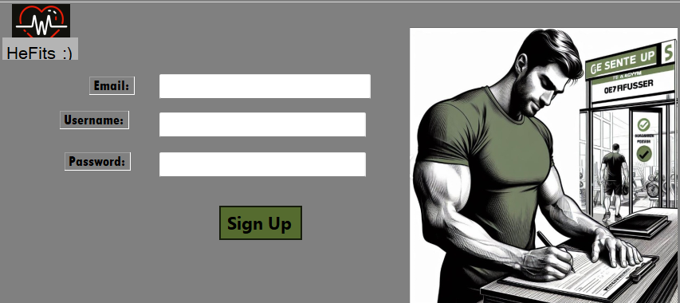

# HeFits
> This is a desktop app designed and developed in Visual Basic

## About:

`HeFits` is a Health and Fitness Tracking System designed to help individuals monitor and manage their health and fitness goals effectively. This software solution offers features to track physical activities, vital signs, and overall wellness metrics. It aims to promote a healthy lifestyle by providing users with personalized insights based on their health data. The target users include fitness enthusiasts, athletes, and individuals looking to improve their overall well-being.

## Features

- **Activity Tracking:** Log various physical activities such as running, cycling, or strength training(part of gym functions), and track duration, and calories burned for each session.
- **Goal Setting and Progress Tracking:** set specific health and fitness goals such as weight loss, muscle gain, or improved endurance.  
- **Feeback**: users can type in what they think about the functionality of the app, in settings. 


## Installation

To install and run the HeFits app:

1. Clone this repository to your local machine:
 ```bash
 git clone git@github.com:konzolaw/HeFits.git
 ```
2. Dependencies.
    - Use Visual Basic  
    - **DBMS** - PostgreSQL
    - Ado.Net + `Npgsql` (NuGet package).
3. Run the app locally.

## Signup For It 📝



## Contributing

Contributions to the **HeFits** app are welcome! If you would like to contribute, please fork the repository, make your changes, and submit a pull request.  

## License
This project is licensed under the MIT License. Refer to the [`license file`](LICENSE) for more information.

## Authors:
These are the contributors

- [Jany Muong](https://github.com/janymuong)
- [Gatmach Yuol Nyuon]()
- [IRKE KONZOLO](https://github.com/konzolaw)
- [Douglas Kimani Kitavi]()
- [Mike Kevin Mugambi]()
- [Joram Kireki]()


## Acknowledgements

This work is a success thanks to the group members who contributed immensely and dedicated their time and resources to this undertaking.
